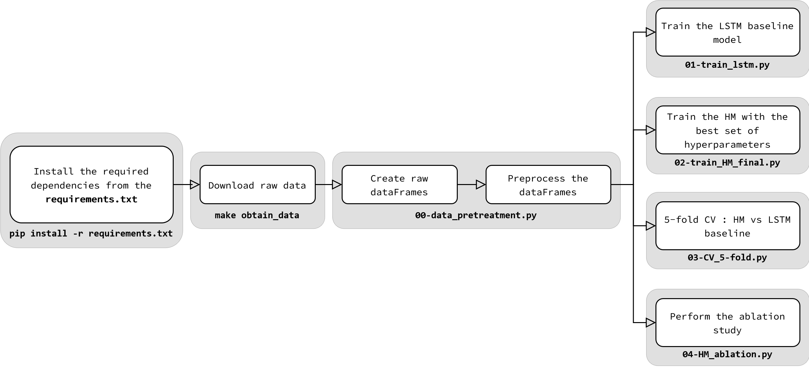

# Drought forecasting
This repository saves all the necessary code to replicate the results of the paper : **Drought forecasting using a hybrid neural architecture for integrating time series and static data.** Published as a workshop paper at "Tackling Climate Change with Machine Learning", ICLR 2025

## Requirements:
To run the code from this repository, please ensure that your system meets the following requirements:

**Software Requirements:**
 - **Python Environment:** A Python installation into an isolated environment is highly recommended. We used **Python v3.10.14.** We used miniconda for the environement, but any alternative should be just as good.

**Hardware Requirements:**
- **GPU (Recommended):** A GPU is advised for faster training. Make sure CUDA is installed and properly configured.
- **Memory:** At least 8GB of RAM is required.
## Replication steps:


Personally, we like to save the execution trace in an external txt file, easier to monitor than the terminal. Especially when doing background executions.

In both, Windows and Linux distributions it is as easy as:

```
[python_invocation] [python_experiment_ script].py > [custom_file_name].txt
```

## About results reports
For better readability a markdown report is created after each experiment. These reports can be transformed into PDFs if the [wkhtmltopdf](https://wkhtmltopdf.org/) tool is available in your machine. Usually the executable is in **/usr/local/bin/wkhtmltopdf**.

To generate the PDFs, simply execute the [extra_tools/markdown_to_pdf.py](extra_tools/markdown_to_pdf.py) script in a terminal, as follows:
```
[python_invocation] extra_tools/markdown_to_pdf.py -wkhtml [path_to_wkhtmltopdf] -md [path_to_MDreport]
```

## Figures and further analysis

The qualitative analyis performed for the the section 3b of the paper can be replicated using the [HM_qualitative_analysis](notebooks/HM_qualitative_analysis.ipynb) notebook.